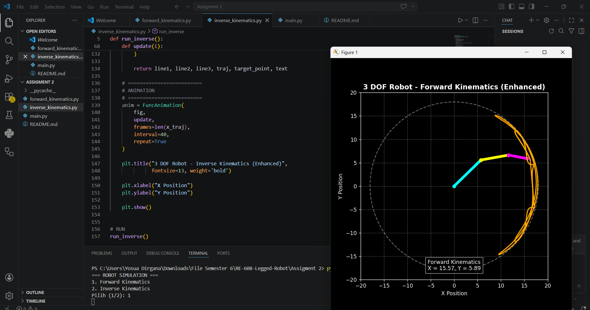
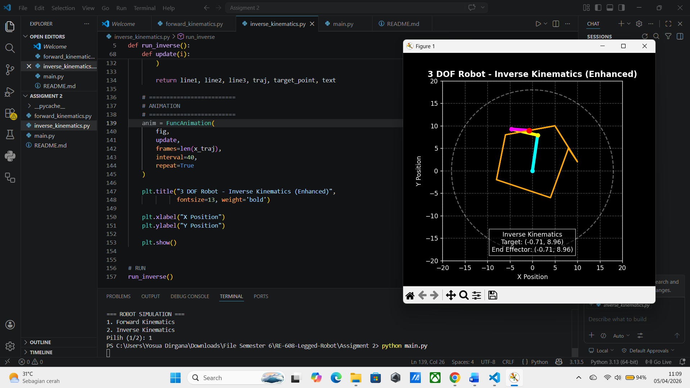

---

## Penjelasan `__pycache__`

Folder `__pycache__` berisi file hasil compile otomatis dari Python dengan ekstensi `.pyc`.

Fungsi:
- Mempercepat eksekusi program  
- Dibuat otomatis saat program dijalankan  

Catatan:
- Bukan bagian utama dari program  
- Tidak perlu diedit  
- Aman jika dihapus (akan dibuat ulang otomatis)  

---

## Forward Kinematics

Digunakan untuk menghitung posisi end-effector berdasarkan sudut joint.

Output:
- Animasi pergerakan robot  
- Trajectory end-effector  
- Posisi X dan Y  

### Hasil Visualisasi

  

---

## Inverse Kinematics

Digunakan untuk menentukan sudut joint berdasarkan target posisi.

Output:
- Robot mengikuti titik target  
- Perbandingan posisi target dan end-effector  
- Animasi pergerakan robot  

### Hasil Visualisasi

  

---

## Cara Menjalankan

1. Install library:

