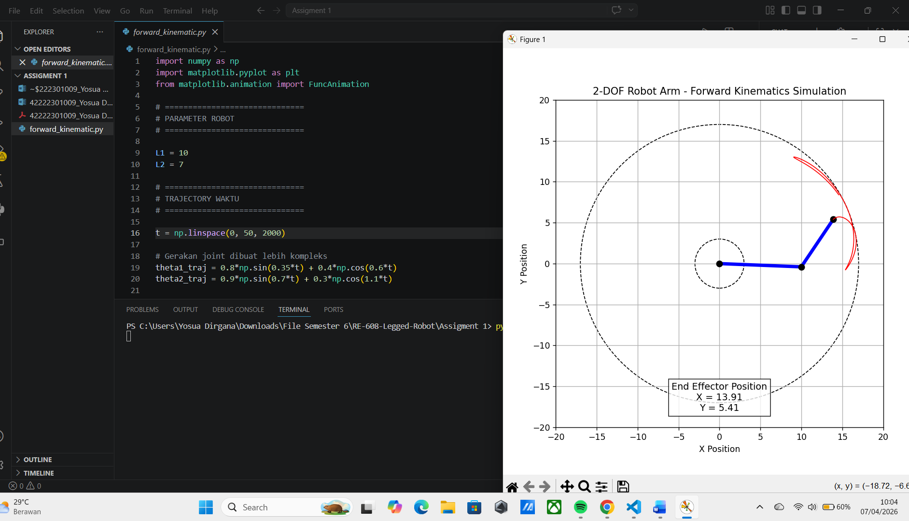
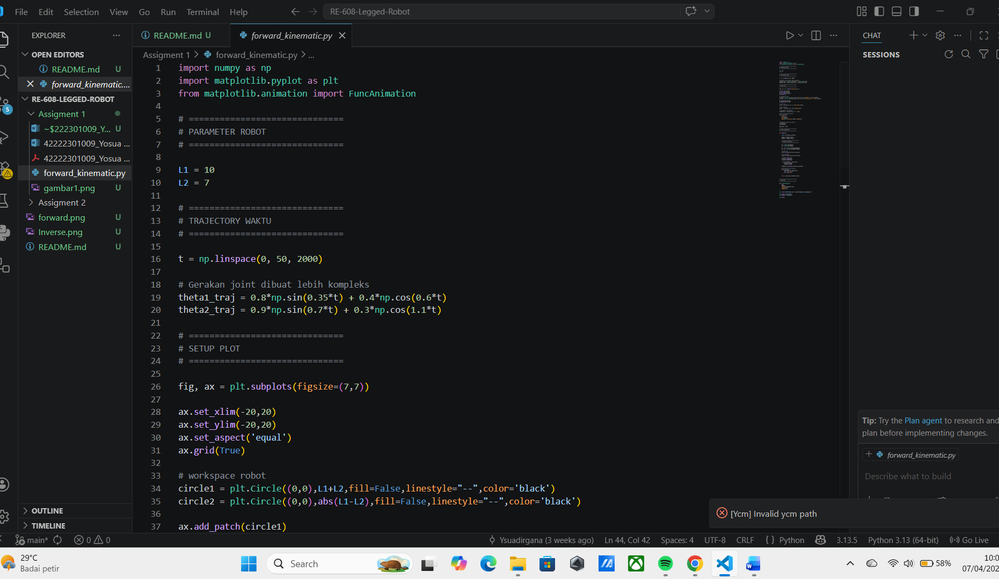

# RE-608 Legged Robot

Repository ini berisi tugas dan dokumentasi untuk mata kuliah **RE-608 Legged Robot**.

---

## 📂 Struktur Repository

```text
RE-608-Legged-Robot
│
├── Assignment 1/
├── Assignment 2/
├── Dokumentasi/
│   ├── gambar1.png
│   ├── gambar2.png
│   ├── forward.png
│   └── Inverse.png
│
└── README.md
```

---

## 📌 Assignment 1 — Forward Kinematic Simulation

Assignment 1 berisi simulasi gerakan **forward kinematic** dan visualisasi lintasan end-effector.

### 🔹 Simulation Result 1


### 🔹 Simulation Result 2


---

## 📌 Assignment 2 — Forward & Inverse Kinematics

Assignment 2 berisi implementasi:

- Forward Kinematics
- Inverse Kinematics
- Visualisasi posisi end-effector

### 🔹 Forward Kinematics


### 🔹 Inverse Kinematics


---

## ▶️ Cara Menjalankan Program

### Assignment 1
```bash
cd "Assignment 1"
python main.py
```

### Assignment 2
```bash
cd "Assignment 2"
python main.py
```

---

## 📘 Penjelasan `__pycache__`

Folder `__pycache__` berisi file hasil compile otomatis dari Python dengan ekstensi `.pyc`.

### Fungsi
- Mempercepat eksekusi program
- Dibuat otomatis saat program dijalankan

### Catatan
- Tidak perlu diedit
- Aman jika dihapus (akan dibuat ulang otomatis)

---

## 📝 Catatan

- Sudut menggunakan satuan **radian**
- Visualisasi menggunakan **matplotlib**
- Program menampilkan **animasi real-time**
- Simulasi digunakan untuk melihat **jalur end-effector**
- Assignment 2 digunakan untuk analisis **forward dan inverse kinematics**

---

## 👨‍💻 Author

**Yosua Dirgana Pratama**